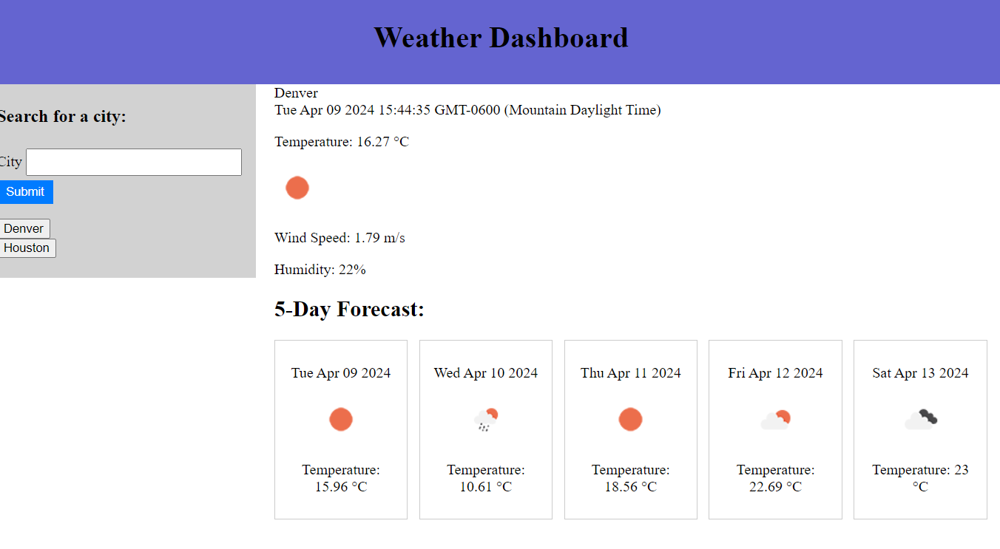

# week-6-weather-dashboard

A weather application that pulls from server side APIs

Deployed Site: https://sleekwingx.github.io/week-6-weather-dashboard/

## References

Islam, O. (2020). weather-dashboard. Github. [URL](https://github.com/OwaisIslam/weather-dashboard/tree/master)

Ramirez, R. (2020). 06-weather-dashboard. Github. https://github.com/rogers0404/06-weather-dashboard/tree/master

Xpert Learning Assistant. (2024, April 9th) https://bootcampspot.instructure.com/courses/5271/external_tools/313

